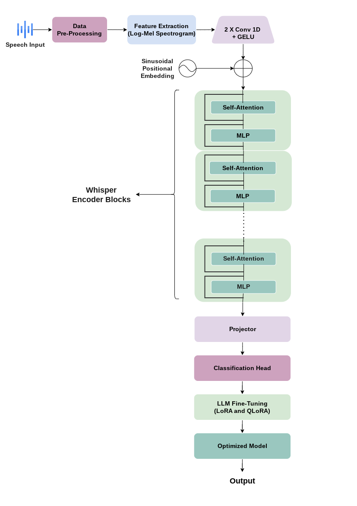

## A Few-Shot Multi-Accented Speech Classification for Indian Languages using Transformers and LLM’s Fine-Tuning Approaches


## Abstract: 
Accented speech classification plays a vital role in the advancement of high-quality automatic speech recognition (ASR) technology. For certain applications, like multi-accented speech classification, it is not always viable to obtain data with accent variation, especially for resource-poor languages. This is one of the major reasons that contributes to the underperformance of the speech classification systems. Therefore, in order to handle speech variability in Indian language speaker accents, we propose a few-shot learning paradigm in this study. It learns generic feature embeddings using an encoder from a pre-trained whisper model and a classification head for classification. The model is refined using LLM’s fine-tuning techniques, such as LoRA and QLoRA, for the six Indian English accents in the Indic Accent Dataset. The experimental findings show that the accuracy of the model is greatly increased by the few-shot learning paradigm’s effectiveness combined with LLM’s fine-tuning techniques. In optimal settings, the model’s accuracy can reach 94% when the trainable parameters are set to 5%.

## Datasets

In this study, we utilized a subset of the Gujarati Digits ([link](https://github.com/Nikunj1729/free-spoken-gujarati-digit-dataset))  dataset in conjunction with the IndicAccentDB ([link](https://ieeexplore.ieee.org/document/9844177)) and a subset of the NISP ([link](https://github.com/iiscleap/NISP-Dataset)) datasets. For multi-class classification, a total of six labels were employed for the six Indian languages. As part of the dataset’s pre-processing, the audio files were resampled to 16 kilohertz. Then, a 400-point Fourier transform was used to make an 80-channel log Mel spectrogram for a 25-millisecond period with a 10-millisecond step. The resulting spectrogram was then used as input for the model’s training.

*Note: IndicAccentDB is not an open-sourced corpus*

## Methodology

The whisper ASR model serves as the foundational framework for the task of classifying accented speech. In this work, we primarily use the encoder component of the model, to which we attached a classification head, excluding the decoder component. Furthermore, we used two of the most popular large language model (LLM) adapters, such as Quantized Low-Rank Adaptation (QLoRA) and Low-Rank Adaptation (LoRA), to make the training and fine-tuning processes efficient and memory friendly.



## Results

The experiments were carried out in a hardware environment equipped with a T4-XLarge, 4 cores, 16 GB of RAM, 1 GPU, and 40 GB of disk space. We conducted experiments utilizing the ’whisper-large-v2’ model with two Large Language Model (LLM) settings: one employing the LoRA adapter and the other employing the QLoRA adapter.
| Rank | Trainable Parameters |LoRA (Accuracy) |QLoRA (Accuracy) |
|--|--|--|--|
| 32 | 80% |93% | 96%|
| 24 | 60% | 91%| 95%|
| 16 | 40% | 90%| 95%|
| 8 | 20% | 85%| 94%|
| 4 |10%  | 89%| 86%|
| **2** | **5%** | **92%**| **94%**|

## Reqirements
* Python setup required for execution
<<<<<<< HEAD
  ```python 
    CUDA 11.8 or higher
    Python v3.7 or higher
    torch==2.0.2
    transformers
    peft
    bitsandbytes 
    datasets 
    accelerate 
    loralib 
    evaluate 
    jiwer
    matplotlib 
    seaborn
=======

* Python setup required for execution
  ```python 
	CUDA 11.8 or higher
	Python v3.7 or higher
	torch
	transformers
	accelerate 
	soundfile 
	librosa 
	evaluate
	jiwer 
	tensorboard 
	gradio
	matplotlib 
	seaborn
>>>>>>> b8a697078d06427827d096d379ff79e86cb1109c


## Installation
* You can install the the libraries by running the following command.

  pip install -r requirements.txt

