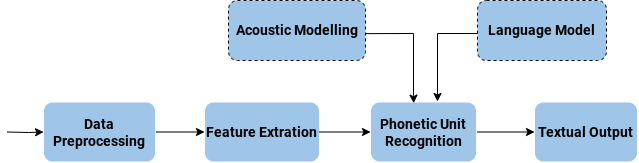

## A Few-Shot Multi-Accented Speech Classification for Indian Languages using Transformers and LLM’s Fine-Tuning Approaches

## Abstract: 
Speech recognition is known to be a specialized application of speech processing. Automatic speech recognition (ASR) systems are designed to perform the speech-to-text task. Although ASR systems have been the subject of extensive research, they still encounter certain challenges when speech variations arise. The speaker’s age, gender, vulnerability, and other factors are the main causes of the variations in speech. In this work, we propose a fine-tuned speech recognition model for recognising the spoken words of vulnerable individuals in Tamil. This research utilizes a dataset sourced from the LT-EDI@EACL2024 shared task. We trained and tested pre-trained ASR models, including XLS-R and Whisper. The findings highlight that the fine-tuned Whisper ASR model surpasses the XLS-R, achieving a word error rate (WER) of **24.452**, signifying its superior performance in recognizing speech from diverse individuals.

## Datasets

The dataset used in this study is from the **shared task LT-EDI@2024**. This shared task aims to develop a Tamil conversational speech corpus collected from vulnerable elderly people and transgender people in Tamil. This speech corpus contains recordings that capture real-world conversions from primary sites such as hospitals, banks, and administrative offices. The corpus contains males, females, and transgender speakers and a total of 7 and a half hours of speech data.

****Note: The dataset is not publicly available, to access the dataset the user needs to be a participant in the shared task.***

## Methodology

In this study, speech recognition was performed using two pre-trained state-of-the-art (SOTA) models, Whisper and XLS-R. Both models were trained on the Tamil corpus, during the experiment it is observed that the whisper model outperfomrs XLS-R model. The whisper model's evaluation results were submitted to the competion.

## Results

The experimental setup comprises a Linux operating system, an 8-core Intel Xeon processor, 32GB of RAM, a 16GB NVIDIA T4 tensor core GPU,and CUDA 11.0.
|Team Names  |  WER (in %) |
|--|--|
| **CEN_Amrita - Jairam Kanna** **(ours)**| **24.452** |
|ASR_TAMIL_SSN| 29.297|
|VIT Chennai| 35.774|
|DRAVIDIAN LANGUAGE - Abirami Jayaraman|  37.733|
|CUET_NLP_GoodFellows - Disco Dancer|  41.031|
 
The official rank list published by the LT-EDI team can be found in the below link.
(https://codalab.lisn.upsaclay.fr/competitions/16094#learn_the_details-results)

## Reqirements
* Python setup required for execution

    >CUDA 11.8 or higher
    > Python v3.7 or higher
    > torch
    > transformers
    > accelerate 
    > soundfile 
    > librosa 
    > evaluate
    > jiwer 
    > tensorboard 
    > gradio
    > matplotlib 
    > seaborn

## Installation
* You can install the the libraries by running the following command.
	 > pip install -r requirements.txt 